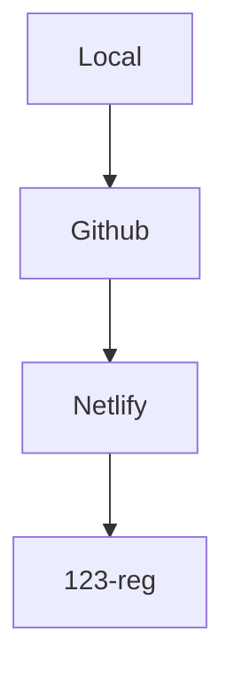

# SVA Site Festival Map 

General project information (You can edit this file / delete sections as the project evolves)

## Dependancies

- [Node Mapnik](https://github.com/mapnik/node-mapnik/)
- [Open Layers](https://openlayers.org)

For now we could add Mapnik to `package.json` file so that Netlify will install it on their servers.

```json
{
  "name": "my-app",
  "version": "1.0.0",
  "scripts": {
    "start": "vite",
    "build": "vite build",
    "serve": "vite preview"
  },
  "devDependencies": {
    "vite": "^4.0.4"
  },
  "dependencies": {
    "ol": "latest",
    "mapnik": "^4.5.9",
  }
}
```

### Examples of similar projects

- [Node-Mapnik Sample Code](https://github.com/mapnik/node-mapnik-sample-code)

## Todo

<!-- CHECK NETLIFY VANILLA JS BUILD -->

- [x] Create local project on your computer
- [x] Matt: Create Github Organization
- [x] Create Github organization project repo on Github
- [ ] Suggestion: Change project name from 'Main' to sitefestmap or similar, to avoid confusion with 'main' branch
- [ ] Set project repo to public, unless don't want it to be public (tell Matt)
- [ ] Matt: Other Options if repo needs to be private
- [ ] Setup Git (See below) for future local development ( Maybe not needed yet? - but good for future )
- [ ] Matt: Add Mapnik dep to `package.json` file for Netlify build
- [ ] Matt: Add other hosting config files `netlify.toml` etc
- [ ] Matt: Deploy to Netlify
- [ ] Matt: CI/CD (Continuous Integration / Continuous Deployment) to automate builds and keep website updated from Github changes.
- [ ] Matt: Configure DNS to setup subdomain on [map.sitefestival.org.uk](https://map.sitefestival.org.uk)
- [ ] If needed : Invite any other members to github organization

If you decide that Github as a choice is not viable  

- [ ] Decide on something else.

## Hosting



## Git Version Control

If you need it, here is some info for setting up Git. If Mapnik can be used by having it on the server but without installing it locally, then this might not be urgent.

Git is a program that tracks changes in files, used by Github / Gitlab and other organizations.

### Project Version Terms

- Local: version that is on a computer
- Remote: version that is any branch that is on a server such as github. 
- Upstream / Origin: relates to the main production branch on github 
- Clone: Pull a copy of a github repo to an empty folder on your computer
- Fork: When anyone with access to the repo makes a copy to their own github account. Their copy won't automatically recieve future changes to the original version, unless requested. Only Public repos can be forked.

### Ways to setup Git projects

- Create a new project on a computer, then push it to Github, creating a new repo in the process, automatically connecting the local and remote version via Git.
- Create a new project on Github, then clone it to an empty folder on your computer, automatically connecting them via Git.
- Create a new project on a computer, create a seperate repo on github, then add the github url as a 'remote' url to the git config on the local version on your computer.

### Configure Git for a project that lives on a local computer to connect to a repo created with the same name

If the local version isn't setup with git, these are some steps to configure Git version control for a project that has a local repo and a github repo, but are not yet connected via git.

#### installing git locally on your machine

Check if Git is already installed

```sh
git -version # check if installed : outputs version number
```

If not installed already, install Git

The easiest way for Mac/Linux is with [Homebrew](https://docs.brew.sh/Installation), which will need installing if not already

If Windows check here [Win](https://git-scm.com/download/win)

Copy and paste the install script into the terminal

```sh
/bin/bash -c "$(curl -fsSL https://raw.githubusercontent.com/Homebrew/install/HEAD/install.sh)"
```

Install Git

```sh
brew install git
```

Git will automatically set you git identity name and email address, but you can set them explicitly too, but they do not have to be related to your github user/email.

```sh
# Set the name you want attached to your commit transactions
git config --global user.name "Your Name"

# Set the email you want attached to your commit transactions
git config --global user.email you@email.com. # quotes not needed as no spaces

# Enable helpful colorization of command line output
git config --global color.ui auto

# Set VS Code as default editor (see docs for other editors)
git config --global core.editor "code --wait"
```

Initilize Git for your project

```sh
cd /path/to/my/project  # go into your project root folder ( change 'project' to whatever your project is named)
git init # creates a file : /my-project-name/.git
```

### `.git` file

when a project is initialized with Git it creates an invisible `.git` file in the project. This file holds information about the repo and it's metadata, and helps Git to index the project files as they change.

You can see the file in a code editor or shell terminal, or if you configure your computer to always show invisible dot files.

You can see the file in the terminal using this command 

```sh
cd my-project
ls -la  # List all files in longform format
```

To sync changes between a local version and the github version they need to be connected via Git.

Add the github repo URL as an origin  (upstream version that will track your local version)

Important : **Change where it says `Main.git` if the project name has changed (eg if it is now something like `sitefestmap.git`).**

```sh
git remote add origin https://github.com/sitefestmap/Main.git
```

Add a `.gitignore` file to the root directory (`my-project/`)

```sh
touch .gitignore
```

Remove Node Modules from the git workflow so that it doesn't get uploaded to Github

Open the project in Code Editor and add node_modules to your `.gitignore` file.
(also .DS_Store if using mac, but not important)

This can be done in VSCode / Editor of your choice,  or a shell editor (nano, vi etc)

This is what the `.gitignore` file will look like

```git
.DS_Store 
node_modules
```

If you make changes on the local development project on your computer, you can push the changes to Github.

A Git Commit will usually include a commit message to say what the change was.

Commit the new `.gitignore` file and push it to the github project.

Add all the changes to git 'staging'

```sh
git add -A # add existing files to the index  also git add --all
```

Commit the changes, including a comment about what you've changed.

```sh
git commit -m "added gitignore file and added node modules to it"  # -m stands for -message, then the "message" comes after
```

Push the changes upstream to the main branch on Github

```sh
git push -u origin main
```

the last line in the resulting output should say something like `Branch 'main' set up to track remote branch 'main' from 'origin'.`

### Git Branches

#### Main Branch

The default branch for local/production version of a project. A 'Main' branch is automatically created when a repo is created.

Git Merging can pull changes from one branch to another, usually by a member or contributor making a 'Pull request'.

## `README.md` Files

A project will usually have a `README.md` markdown file, that has general information about the project.

[What is Markdown?](https://github.github.com/gfm/#what-is-markdown-)

## Deployment

### Netlify

Netlify can deploy from a personal private/public repo, or from Organization Public repos.

#### `netlify.toml` file

One of the config files that Matt will set up.

This file lives in the root folder and holds some information for telling Netlify how to build your site.

```toml
[build]
  command = "npm run build"
  publish = "build/"
  functions = "functions/"
```

Netlify will run `npm run build` if no other build commands are set.
