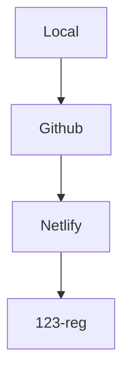

# SVA Site Festival Map 

General project information (You can edit this file / delete sections as the project evolves)

## Todo

- [x] Create local project on your computer
- [x] Matt: Create Github Organization
- [x] Create Github organization project repo on Github
- [ ] Make repo public (matt will do this)
- [ ] Setup Git
- [ ] Matt: Add other hosting config files `netlify.toml` etc
- [x] Matt: Deploy to Netlify
- [ ] Matt: CI/CD (Continuous Integration / Continuous Deployment) to automate builds and keep website updated from Github changes.

- [x] Matt: Configure DNS to setup subdomain on [map.sitefestival.org.uk](https://map.sitefestival.org.uk)
- [ ] If needed : Invite any other members to github organization

## Sites

- [Site Festival](https://sitefestival.org.uk)
- [Development](https://mapdev.sitefestival.org.uk)
- [Holding Page](https://map.sitefestival.org.uk)

## Dependancies

- [Node Mapnik](https://github.com/mapnik/node-mapnik/)
- [Open Layers](https://openlayers.org)

### Examples of similar projects

- [Node-Mapnik Sample Code](https://github.com/mapnik/node-mapnik-sample-code)

### Online Sandboxes for trying Mapnik etc

- [Code Sandbox (install node packages in online terminal, and can sync with Github as well)](https://codesandbox.io)
- [Codepen - can install packages](https://codepen.io/)

## Hosting

**Todo: Git / Config info / Merge matt private deploy repo / map master into map main**
