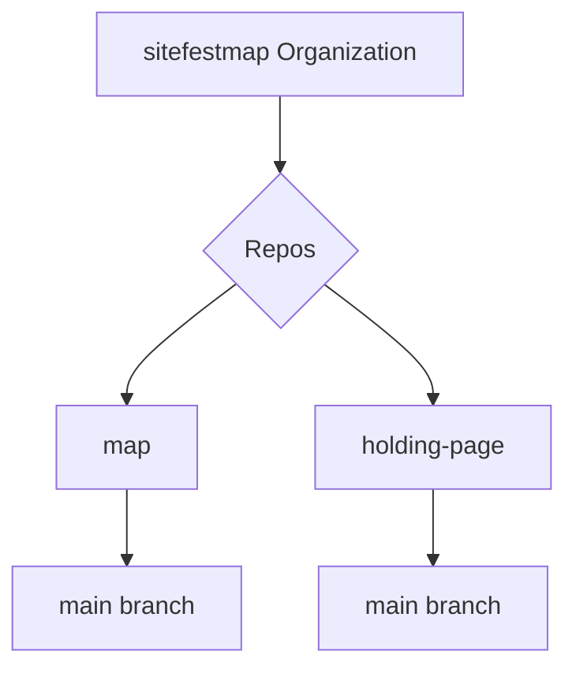

# SVA Site Festival Map 

```geojson
{ "type": "Feature",
   "geometry": {
     "type": "Polygon",
     "coordinates": [

       [ [-2.275,51.725], [-2.175,51.725], [-2.175,51.775],
         [-2.275,51.775], [-2.275,51.725] ]
       ]
   },
   "properties": {
     "prop0": "value0",
     "prop1": {"this": "that"}
     }
}

```

## Todo

- [ ] Help setup Github Desktop

## Dependancies

- [Node Mapnik](https://github.com/mapnik/node-mapnik/)
- [Open Layers](https://openlayers.org)

### Examples of similar projects

- [Node-Mapnik Sample Code](https://github.com/mapnik/node-mapnik-sample-code)

### Online Sandboxes for trying Mapnik etc

- [Code Sandbox (install node packages in online terminal, and can sync with Github as well)](https://codesandbox.io)
- [Codepen - can install packages](https://codepen.io/)

## Git 

The default name for a repo production branch is 'main' . It used to be 'master', but has changed in recent years.
     


### Github Desktop

#### Clone to an empty folder

file > clone repository > scroll down > sitefestmap > map > clone
file > clone repository > scroll down > sitefestmap > holding-page > clone

#### Open Github repo

Github repo > Code > Open in Github

## Vite Config

This needs setting up for Multi-page apps in Vite, where there are multiple HTML files in the root folder.

```sh
import { resolve } from 'path'
import { defineConfig } from 'vite'

export default defineConfig({
  build: {
    rollupOptions: {
      input: {
        main: resolve(__dirname, 'index.html'),
        next: resolve(__dirname, 'index2.html'),
      },
    },
  },
})
```

Netlify will run `npm run build` if no other build commands are set.
