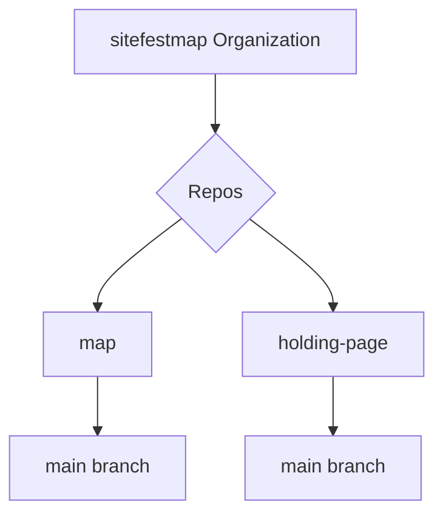

# SVA Site Festival Map 

```geojson
{ "type": "Feature",
   "geometry": {
     "type": "Polygon",
     "coordinates": [

       [ [-2.275,51.725], [-2.175,51.725], [-2.175,51.775],
         [-2.275,51.775], [-2.275,51.725] ]
       ]
   },
   "properties": {
     "prop0": "value0",
     "prop1": {"this": "that"}
     }
}

```



## Vite Config

Config for Vanilla JS Multi-page apps in Vite, where there are multiple HTML files in the root folder.

```sh
import { resolve } from 'path'
import { defineConfig } from 'vite'

export default defineConfig({
  build: {
    rollupOptions: {
      input: {
        main: resolve(__dirname, 'index.html'),
        next: resolve(__dirname, 'index2.html'),
      },
    },
  },
})
```

Netlify will run `npm run build` if no other build commands are set.
